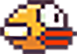

# Simple Flappy Bird
## Description
- <strong>SFML</strong> and <strong>C++</strong>
- Implement a simple version of <strong>Flappy Bird</strong>
## Personal Project
- first attempt building a game by following Udemy online course
- Flappy Bird SFML 
## How to run the project
- Before running the project: 
- Install homebrew:  $ /usr/bin/ruby -e "$(curl -fsSL https://raw.githubusercontent.com/Homebrew/install/master/install)"
- Then install sfml: $ brew install sfml
- It's a Xcode project, but it should be fine if you use other environments.
- For Xcode, open the XcodeProject file, and run it.

